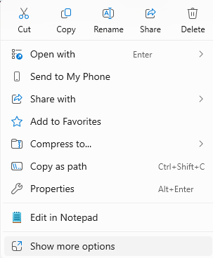
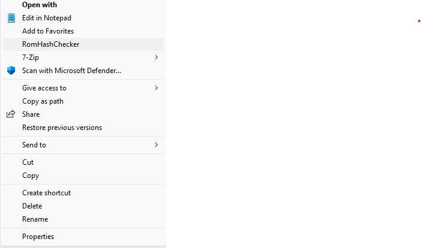
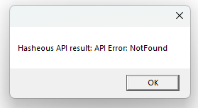

# RomHashChecker

This tool adds a right click menu option in File Explorer. When clicked, it will check [hasheous.org](https://hasheous.org/) for a match of the selected file's MD5 hash.

## Usage
1. Right click on any file in File Exporter.
2. Click "Show More Options"

3. Click "RomHashChecker"

If the hash is found in the Hasheous API then you will see the name of the ROM.

If is is not found you will see an error message.

## Instalation
1. Open Regedit.
2. Go to: HKEY_CLASSES_ROOT\*\shell
3. Right-click shell → New → Key: name it Compute MD5 Hash.
4. Under that, add another key called command.
5. Set command’s (Default) value to:"C:\Path\To\RomHashChecker.exe" "%1"

